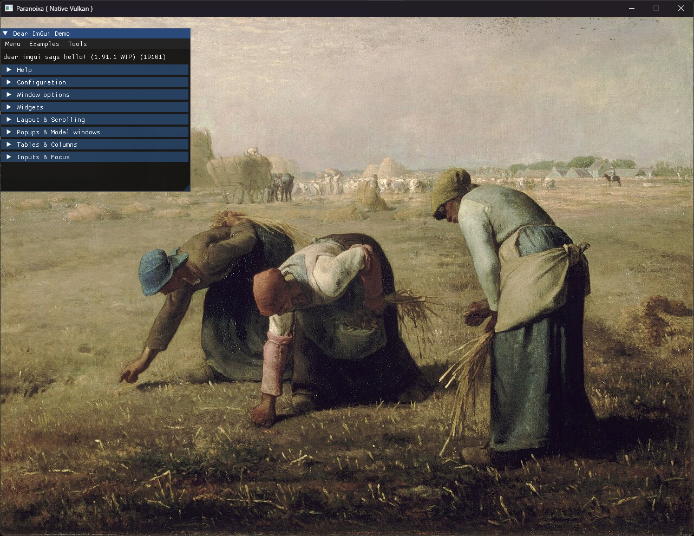

日々の進捗です  
よく見たらテクスチャが正しく表示されていなかったので修正
<blockquote class="twitter-tweet">
ようやくテクスチャ <a href="https://t.co/XuYIvcXAyK">pic.twitter.com/XuYIvcXAyK</a>
&mdash; astomih (@astomih) <a href="https://twitter.com/astomih/status/1835524716662325406?ref_src=twsrc%5Etfw">September 16, 2024</a></blockquote>  

  
そのほか、メモリアロケータやPtrの実装など